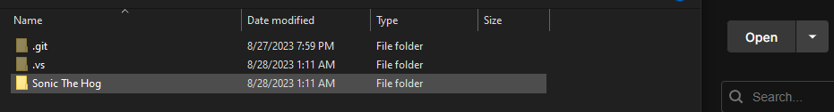

Sonic The Hedge Hog
=============

# 🚀 Getting Started
### To get started there are a few software you should have installed.   Start by installing **Visual Studio, Unity Editor, and Unity Hub**

#### To Clone the repo first open **Visual Studio** then click clone repository in the file tab. From there you can select GitHub (Enter your Credentials), then paste the URL from this repo.   The location where you save the clone doesn't matter but I prefer **(user/source/repos)**

### After successfully cloning the Repo open **Unity Hub** and open a project. navigate to your repo and select the folder labeled **Sonic The Hog** This is our Unity project

### Congratulations you now have a cloned project of Sonic The hedge Hog :tada:
